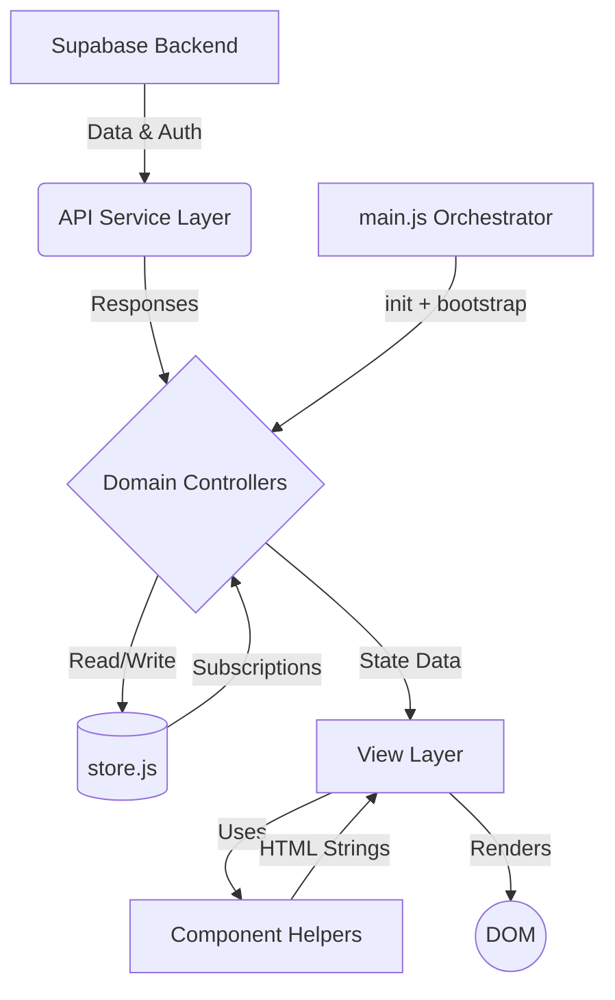

# Paral·lel Film Festival - System Architecture

This document describes the architecture of the Paral·lel Film Festival application. It is intended to help developers understand the module structure, data flow, state management, and key design decisions.

## Overview

The application is a **Vanilla JavaScript Single Page Application (SPA)** powered by [Vite 5](https://vitejs.dev/). It uses no heavy reactive frameworks — state is managed with a custom reactive store, and the UI is driven by a layered **Service → Controller → View** architecture.

The backend is fully serverless, powered by **Supabase** (PostgreSQL, Realtime Auth, and Edge Functions). TMDB API access is proxied through a Supabase Edge Function to keep the API key server-side.

---

## Architecture Diagram



---

## Module Breakdown

### 1. Orchestrator (`main.js`)

`main.js` is a **thin orchestrator** (~330 lines). It does not contain business logic, UI code, or direct Supabase calls. Its responsibilities are:

- **Bootstrap:** Calls `init()` on each domain controller on app load.
- **Routing:** Implements `handleRouting()` to switch views based on `window.location.hash`.
- **Data fetch on refresh:** `refreshData()` coordinates parallel data fetches across controllers.
- **Global window proxy:** Proxies legacy global variable reads/writes into `store.js` for backward compatibility (e.g. `window.allMovies`, `window.user`).
- **Preloader lifecycle:** Manages the loading screen with a min/max visibility constraint.

`main.js` does **not** bind individual DOM event listeners — those are delegated to each domain controller's `init()`.

---

### 2. Domain Controllers (`src/controllers/`)

Each controller owns one bounded slice of functionality. They are the primary units of business logic. On app startup, each exposes an `init()` function that wires up its own DOM event listeners.

| Controller | File | Owns |
|---|---|---|
| Auth | `AuthController.js` | Authentication state, user profile rendering, activity log |
| Admin | `AdminController.js` | Admin panel tabs, app settings, inactive movie culling |
| Explore | `ExploreController.js` | TMDB search, AI recommendation search, genre/provider maps |
| Movie | `MovieController.js` | Proposals, voting, history, cemetery, lazy rendering |
| Ranking | `RankingController.js` | Leaderboard computation, achievement stats |
| Session | `SessionController.js` | Festival sessions, signups, admin session management |

#### `AuthController.js`
- Wraps `supabase.auth.onAuthStateChange` to react to login/logout events.
- Renders the user header, profile page, and activity log.
- Exports `checkUser()`, `updateAuthUI()`, `loadUserActivity()`, and `init()`.
- On logout or login, fires `authui:update` to synchronize dependent UI.

#### `AdminController.js`
- Wires admin panel tab navigation (`[data-tab]` click handlers).
- Exports `fetchAppSettings()`, `saveAppSettings()`, `cleanupInactiveMovies()`, and `init()`.
- The cleanup function implements **smart pool maintenance**: scores each inactive candidate by `total_votes × (recent_votes > 0 ? 2 : 1)` and sends only the bottom 50% to the cemetery.

#### `ExploreController.js`
- Fetches and caches `genreMap` and `providerMap` in `store.js`.
- Wires the explore tab (manual filters + AI search input) event listeners.
- Exports `fetchGenreMap()`, `fetchProvidersMap()`, `init()`.

#### `MovieController.js`
- Handles all movie lifecycle operations: propose, vote, mark-as-seen, drop-to-cemetery, rate/review, delete.
- Implements lazy/progressive rendering for the proposals list (IntersectionObserver + fallback timer).
- Exports: `renderProposals()`, `renderHistory()`, `renderCemetery()`, `renderTopVotedShowcase()`, `enrichMovieData()`, `renderHomeAchievements()`, `fetchRecentAchievementEvents()`, `init()`.
- Registers `window.proposeMovie`, `window.toggleVote`, `window.dropMovie`, `window.markAsSeen`, `window.rateMovie`, `window.deleteMovie`, and `window.unmarkAsSeen` as global handlers.

#### `RankingController.js`
- Builds user score maps from participation log data.
- Exports `updateGlobalRanking()`, `renderRankingView()`, `buildUserScoreStatsMap()`, `buildUserPointsAudit()`.
- No DOM event listeners — purely data/render driven.

#### `SessionController.js`
- Fetches upcoming and past festival sessions.
- Exports `fetchSessions()`, `renderSessions()`, `renderNextSessionHero()`, `updateAdminSessions()`, `init()`.
- Wires session signup/check-in buttons in `init()`.

---

### 3. State Management (`src/state/store.js`)

A lightweight custom reactive store — no Redux, no Zustand. All application state lives here.

**API:**
```js
store.getState()           // Returns live internal state object
store.setState({ key: v }) // Shallow merge + notify all subscribers
store.setUserVotes(set)    // Specialized helper for vote set
store.subscribe(fn)        // Register a callback on any state change
```

**State shape:**
```js
{
  // Collections
  allMovies: [],
  proposedMovies: [],
  seenMovies: [],
  droppedMovies: [],
  rankedUsers: [],
  sessions: [],

  // Auth
  user: null,
  userProfile: null,
  isAdmin: false,
  userVotes: Set,
  userAttendance: Set,

  // UI
  currentView: 'home',
  currentSession: null,
  profileAuditMode: 'activity',
  authSyncSequence: 0,

  // Config (from DB)
  maxProposals: null,
  maxVotes: null,

  // Lookups
  genreMap: {},
  providerMap: {}
}
```

Subscribers receive a **deep frozen readonly snapshot** to prevent accidental mutation.

---

### 4. API Service Layer (`src/api/`)

Pure data-access objects. No UI or controller logic. Each module exports a named service object.

| File | Service | Responsibilities |
|---|---|---|
| `movies.js` | `MovieService` | CRUD for movies, votes, ratings, enrichment |
| `sessions.js` | `SessionService` | Sessions, signups, attendance, check-ins |
| `admin.js` | `AdminService` + utils | User management, settings, cleanup, social metadata |
| `auth.js` | `AuthService` | Supabase auth wrappers |
| `achievements.js` | `AchievementService` | Score/medal computation |
| `tmdb.js` | `TMDBService` | TMDB API proxy via Supabase Edge Function |

`admin.js` also exports two pure utility functions used by `AdminController`:

```js
export function computeActivityScore(totalVotes, recentVotes) {
  return totalVotes * (recentVotes > 0 ? 2 : 1);
}

export function selectBottomHalf(movies) {
  const sorted = [...movies].sort((a, b) => a.score - b.score);
  return sorted.slice(0, Math.floor(sorted.length / 2));
}
```

---

### 5. View Layer (`src/views/`)

Modules responsible for rendering large DOM sections. They receive state data and call component helpers to build the HTML.

| File | View | Renders |
|---|---|---|
| `HomeView.js` | `HomeView` | Proposals grid, history list, cemetery, showcase |
| `AdminView.js` | `AdminView` | Admin panel sections (users, logs, settings) |
| `ProfileView.js` | `ProfileView` | User profile, audit panel, activity timeline |
| `ExploreView.js` | `ExploreView` | Search results grid |
| `SessionsView.js` | `SessionsView` | Session cards list |

Views do not fetch data themselves — they receive it from controllers.

---

### 6. Component Layer (`src/components/`)

Stateless pure functions that return HTML template literal strings. They are the atomic rendering units.

| File | Exports |
|---|---|
| `MovieCard.js` | `createMovieCardHTML(movie, options)` |
| `Sessions.js` | `createSessionCardHTML()`, `createSessionHeroHTML()` |
| `Ranking.js` | `createRankingRowHTML()`, `createTimelineItemHTML()` |
| `Achievements.js` | `createAchievementCardHTML()`, `renderAvatarStack()` |

`createMovieCardHTML` supports rendering contexts: `'proposal'`, `'history'`, `'showcase'`, `'cemetery'`, `'explore'`. The context controls which UI elements appear (vote buttons, rating stars, admin overlays, vote count badge, etc.).

---

### 7. Configuration & Utilities

| Path | Purpose |
|---|---|
| `src/config/supabase.js` | Supabase client singleton |
| `src/config/constants.js` | Static app-wide constants (FALLBACK_IMAGE, ACHIEVEMENT_LIST, etc.) |
| `src/utils/index.js` | `normalize`, `escapeHtml`, `showNotification`, `getUserDisplayName`, etc. |
| `src/utils/formatters.js` | `formatScore`, `formatRuntime`, `timeAgo` |
| `src/utils/ui.js` | DOM helpers |
| `src/utils/user.js` | User display helpers |

---

## Data Flow Example — Proposing a Movie

1. User clicks "Propose" on an Explore search result → `window.proposeMovie(movie)` fires.
2. `MovieController.proposeMovie()` calls `MovieService.findMovieByTMDBId()` to check for duplicates.
3. If new, `MovieService.createMovie()` writes to Supabase.
4. Controller fetches the updated movie list and calls `store.setState({ allMovies, proposedMovies })`.
5. `HomeView.renderProposals(state.proposedMovies)` uses `createMovieCardHTML()` to update the DOM.

## Data Flow Example — Smart Pool Maintenance (Admin)

1. Admin clicks "Cleanup Cemetery" in the admin panel.
2. `AdminController.cleanupInactiveMovies()` fetches all unseen, non-dropped movies with `created_at` older than 15 days.
3. Fetches all vote counts and recent vote counts (last 15 days) for candidates.
4. Scores each candidate: `total_votes × (recent_votes > 0 ? 2 : 1)`.
5. Calls `selectBottomHalf()` to pick the lowest-scoring 50% as the cull target (always rounds down — cull fewer when uncertain).
6. Sets `is_dropped = true` on those movies. **Votes are preserved** in the `votes` table.
7. UI shows a notification: `"Sent N movies to cemetery (bottom 50% by activity)"`.

## Vote Lifecycle and Cemetery Behavior

- **Manual drop** (`dropMovie`): sets `is_dropped = true`. Votes are **preserved**.
- **Auto-cull** (`cleanupInactiveMovies`): sets `is_dropped = true`. Votes are **preserved**.
- **Restore from cemetery** (`unmarkAsSeen` / `is_dropped = false`): votes remain — the movie recovers its full vote history.
- **Permanent delete** (`deleteMovie`): hard-deletes the row. Supabase CASCADE removes all associated votes, ratings, and reviews.

Cemetery cards display the preserved vote count so admins and users can see a dropped movie's historical popularity.

---

## Testing

Tests live in `tests/` and run with [Vitest 2](https://vitest.dev/) + jsdom.

```
tests/
├── controllers/
│   ├── ExploreController.test.js   # fetchGenreMap, fetchProvidersMap, pure helpers
│   └── RankingController.test.js   # score computation, medal assignment
└── api/
    └── AdminService.test.js        # computeActivityScore, selectBottomHalf
```

Run all tests:
```bash
npm test
```

Run a specific file:
```bash
npx vitest run tests/api/AdminService.test.js
```

---

## File Structure

```
parallelfilmfestival/
├── main.js                      # Thin orchestrator (~330 lines)
├── index.html                   # App shell
├── next-session.html            # Social preview page (OG tags)
├── vite.config.js
├── package.json
├── supabase/
│   └── functions/               # Edge Functions (TMDB proxy, delete-user)
├── src/
│   ├── controllers/             # Domain controllers (business logic + event wiring)
│   │   ├── AdminController.js
│   │   ├── AuthController.js
│   │   ├── ExploreController.js
│   │   ├── MovieController.js
│   │   ├── RankingController.js
│   │   └── SessionController.js
│   ├── api/                     # Service layer (Supabase + TMDB data access)
│   │   ├── admin.js
│   │   ├── achievements.js
│   │   ├── auth.js
│   │   ├── movies.js
│   │   ├── sessions.js
│   │   └── tmdb.js
│   ├── views/                   # Screen-level renderers
│   │   ├── AdminView.js
│   │   ├── ExploreView.js
│   │   ├── HomeView.js
│   │   ├── ProfileView.js
│   │   └── SessionsView.js
│   ├── components/              # Stateless HTML component functions
│   │   ├── Achievements.js
│   │   ├── MovieCard.js
│   │   ├── Ranking.js
│   │   └── Sessions.js
│   ├── state/
│   │   └── store.js             # Reactive state singleton
│   ├── config/
│   │   ├── constants.js
│   │   └── supabase.js
│   └── utils/
│       ├── formatters.js
│       ├── index.js
│       ├── ui.js
│       └── user.js
└── tests/
    ├── controllers/
    │   ├── ExploreController.test.js
    │   └── RankingController.test.js
    └── api/
        └── AdminService.test.js
```
