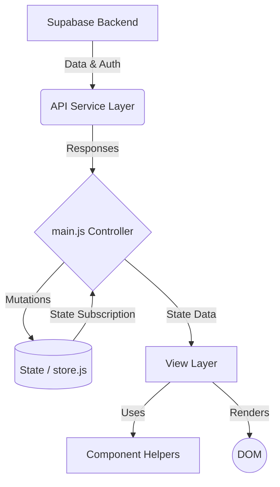

# Paral·lel Film Festival - System Architecture

This document provides a high-level overview of the architecture and module structure for the Paral·lel Film Festival application. It is intended to help developers understand the codebase, state flow, and data layers.

## Overview

The application is built as a **Vanilla JavaScript Single Page Application (SPA)** powered by [Vite](https://vitejs.dev/). It does not use heavy reactive frameworks like React or Vue. Instead, it relies on a strict **Service-Controller-View** architecture to keep the codebase modular, maintainable, and highly performant.

The backend is completely serverless, powered by **Supabase** (PostgreSQL, Auth, and Edge Functions).

---

## Architecture Diagram

---

## Module Breakdown

### 1. Controller Layer (`main.js`)
The `main.js` file acts as the primary controller and entry point of the application. 
- **Routing:** It manages the `window.navigateTo` logic to show/hide different views.
- **Event Listeners:** Binds global DOM events (clicks, inputs, auth changes).
- **Orchestration:** Fetches data from the API services, updates the centralized store, and commands the View layer to render the UI.
- *Note:* It maintains **zero mutable global state** and performs **zero direct API calls**.

### 2. State Management (`src/state/store.js`)
Since this is a vanilla JS application, state is centralized in a custom reactive store.
- Replaces global variables (`allMovies`, `user`, etc.).
- Exposes `.getState()`, `.setState()`, and `.subscribe()` methods.
- Provides a single source of truth for the application state, allowing views to react predictably.

### 3. API Service Layer (`src/api/`)
This layer encapsulates all external communications (Supabase database, Auth, and TMDB). It prevents API logic from leaking into the UI or Controller layers.
- **`movies.js`**: Fetches, proposes, rates, and deletes movies.
- **`sessions.js`**: Manages festival sessions, signups, and check-ins.
- **`admin.js`**: Handles administrative tasks like user deletion, role fetching, and inactive movie archiving.
- **`auth.js`**: Wraps Supabase authentication methods.
- **`achievements.js`**: Calculates gamification scores and medals.
- **`tmdb.js`**: Interfaces with TMDB via our secure Supabase Edge Function proxy.

### 4. View Layer (`src/views/`)
Modules responsible for DOM manipulation and rendering complete screens.
- Examples: `HomeView.js`, `AdminView.js`, `ProfileView.js`.
- These modules receive state data from the controller and orchestrate the updating of large sections of the UI.
- They do not fetch data themselves; they only consume what `main.js` provides.

### 5. Component Layer (`src/components/`)
Pure functions that return HTML template literals for reusable UI elements.
- Examples: `createMovieCardHTML()`, `createAchievementCardHTML()`.
- They are stateless, taking in primitive data or objects and returning a formatted HTML string to be injected by the View layer.

### 6. Configuration & Utilities (`src/config/` & `src/utils/`)
- **`constants.js`**: Stores system-wide configuration variables, fallbacks, and limits.
- **`supabase.js`**: Initializes and exports the Supabase client singleton.
- **`index.js`**: Contains pure utility functions for string normalization, date formatting, and UI notifications.

---

## Data Flow Example (Proposing a Movie)

1. **User Action:** The user clicks "Propose" on a search result. The DOM fires an event triggering `window.proposeMovie(movie)`.
2. **Controller Logic:** `main.js` intercepts the request, checks if the movie is already in the database using `MovieService.findMovieByTMDBId()`.
3. **API Call:** If safe to insert, `MovieService.createMovie()` sends the data to Supabase.
4. **State Update:** `main.js` fetches the updated list of movies and pushes it to `store.setState({ allMovies: newMovies })`.
5. **UI Render:** `main.js` calls `HomeView.renderProposals(state.proposedMovies)`, which uses `createMovieCardHTML()` to update the DOM.
